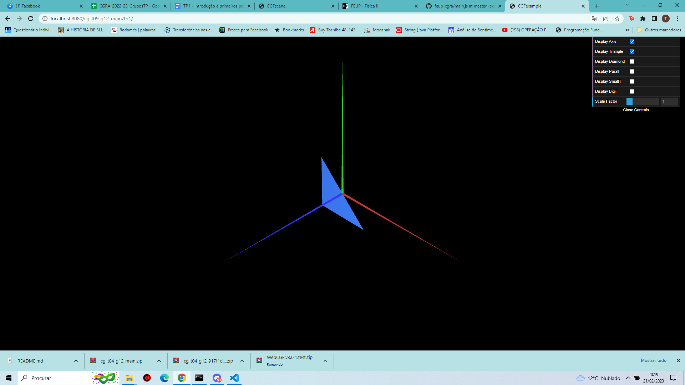
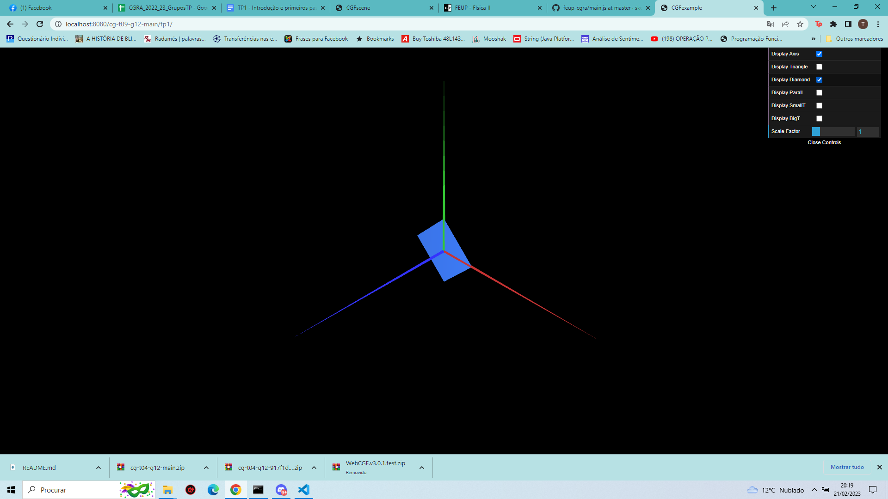
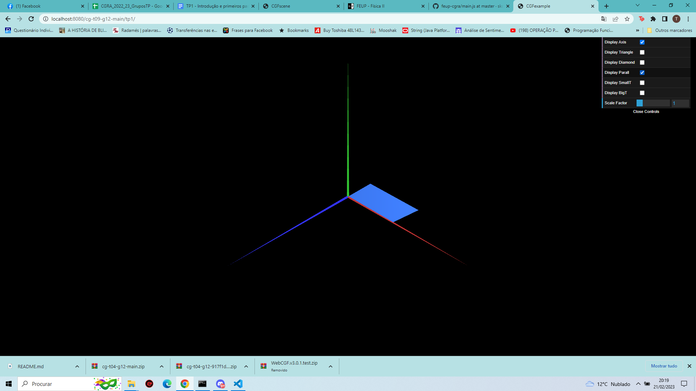
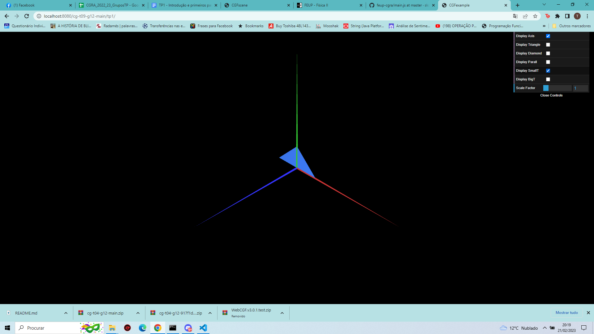
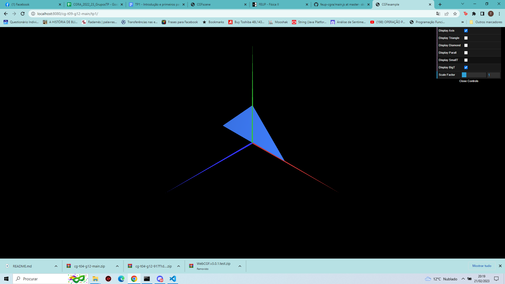

# CG 2022/2023

## Group T09G12

## TP 1 Notes

(add your main observations/remarks about your experiments here, in a bulleted list, and remove this line. Some examples below)

- In exercise 1 we observed X
- In exercise 2 we had difficulties in Y

